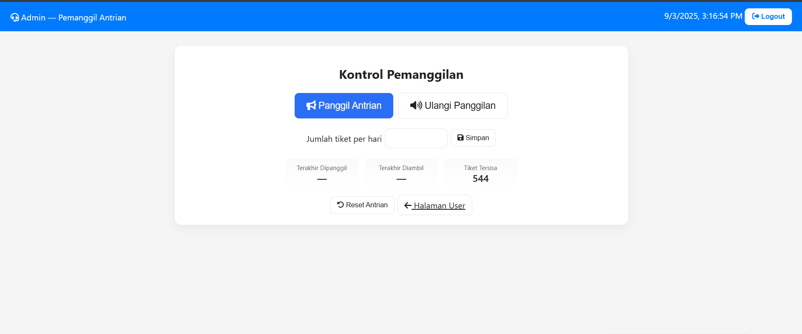

# 🏢 Queue Management System — AntrianV1

[](https://github.com/s4rt4/antrianv1)
[](https://s4rt4.github.io/antrianv1)

A simple **web-based queue management system** for **a single counter** with voice call support.  
This project is built entirely using **HTML, CSS, and vanilla JavaScript** (no backend / no database).  
It can run directly in any modern browser and is suitable for **thesis projects, demonstrations, or small-scale practical use** (e.g., shops, clinics, ticket offices).

---

## 🌐 Live Demo
🔗 [Try it here](https://s4rt4.github.io/antrianv1)

---

## ✨ Features

### 👤 **User Page (index.html)**
- Take a queue ticket with a single click.
- Print the ticket (popup print dialog).
- Reprint the last taken ticket.
- Display real-time queue information:
  - Last number called.
  - Last number taken.
  - Remaining tickets.
- **Dark/Light mode** toggle button in the navbar.
- Modern **blue navbar**:
  - Left: realtime clock & date.
  - Center: theme toggle button with Font Awesome icon.
  - Right: styled **Admin Area** button.

### 🔑 **Login Page (login.html)**
- Simple username/password login (stored on frontend only).
- On success → redirects to the admin page.

### 🛠 **Admin Page (admin.html)**
- Blue navbar with realtime clock and logout button.
- Queue management controls:
  - **Call next queue number** (with audio announcement).
  - **Repeat last call** button.
  - **Reset queue** (clear all counters).
  - **Set maximum tickets per day**.
- Real-time queue statistics:
  - Last number called.
  - Last number taken.
  - Remaining tickets.
- **Audio announcements with MP3 files**:
  - If no ticket has been taken → plays `belumadaantrian.mp3` (“no queue yet”).
  - If a valid ticket number is called → plays sequence of files (e.g. `antrian-nomor.mp3` + `tigapuluh.mp3` + `lima.mp3`).
  - If all tickets are finished → plays `antrianhabis.mp3`.
  - Supports **up to 500 queue numbers**.
- **Preloads audio files** to minimize delay when playing announcements.

---

## 📂 Project Structure

antrianv1/
│
├── index.html # User page
├── login.html # Admin login page
├── admin.html # Admin dashboard (queue caller)
│
├── css/
│ └── style.css # Styling (blue navbar, buttons, dark/light mode, etc.)
│
├── js/
│ ├── index.js # User page logic
│ ├── login.js # Login logic
│ └── admin.js # Admin logic + audio system
│
└── sounds/ # Audio files (MP3)
├── antrian-nomor.mp3
├── belumadaantrian.mp3
├── antrianhabis.mp3
├── satu.mp3, dua.mp3, tiga.mp3 ... sembilanbelas.mp3
├── duapuluh.mp3, tigapuluh.mp3 ... sembilanpuluh.mp3
├── seratus.mp3, duaratus.mp3 ... limaratus.mp3
└── etc.


---

## ⚙️ Technologies Used
- **Frontend**:
  - [HTML5](https://developer.mozilla.org/en-US/docs/Web/HTML)  
  - [CSS3](https://developer.mozilla.org/en-US/docs/Web/CSS)  
  - [Vanilla JavaScript](https://developer.mozilla.org/en-US/docs/Web/JavaScript)  
- **Local Storage & Session Storage**:  
  - Used to store queue state (`lastTaken`, `lastCalled`, `maxTickets`).  
  - Allows the app to run without any backend or database.  
- **Audio system**:  
  - Modular MP3 files generated with **Text-to-Speech (TTS)**.  
  - Plays multiple files in sequence for natural pronunciation.  
- **UI Enhancements**:  
  - [Font Awesome](https://fontawesome.com/) for icons.  

---

## 🔉 Text-to-Speech
All `.mp3` files inside the `sounds/` folder were generated using a **Text-to-Speech engine** and then downloaded.  
Advantages:
- Natural and consistent voice.
- Works offline, no API calls required.
- Safe to publish on GitHub (no exposed API keys).

---

## 🖼 Screenshots
(*Add screenshots in a `docs/` folder to display them in the README.*)

- **User Page (index.html)**  
    

- **Login Page (login.html)**  
    

- **Admin Page (admin.html)**  
    

---

## 🚀 How to Run
1. Clone the repository:
   ```bash
   git clone https://github.com/s4rt4/antrianv1
   cd antrianv1
